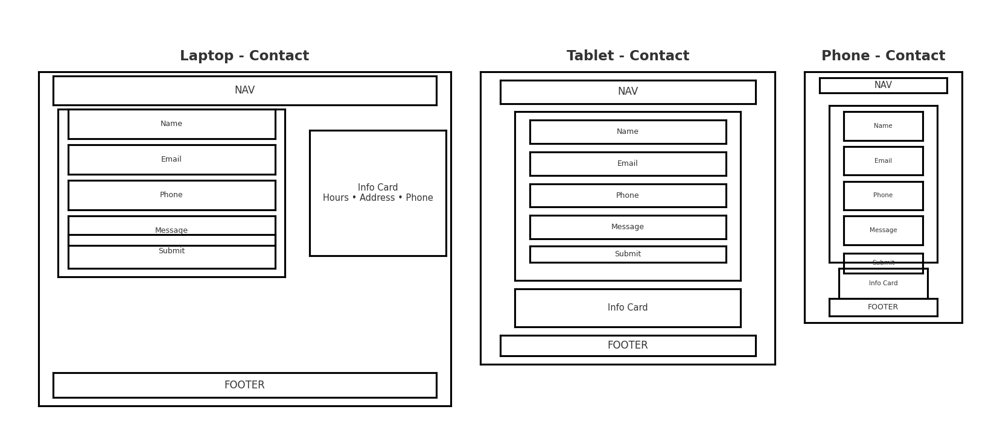
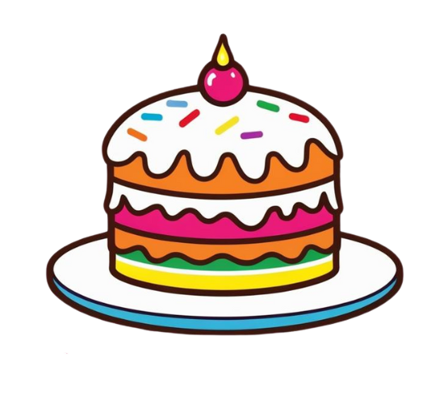
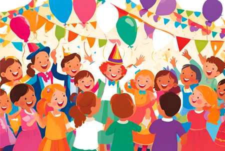

# Cake, Fun and Confetti – Web Development Project

## Contents
- [Project Overview](#project-overview)
- [User Stories](#user-stories)
- [Technologies Used](#technologies-used)
- [Aknowlegments](#aknowlegments)
- [References](#references)
- [Installation and Access](#installation-and-access)
- [Project Structure](#project-structure)
  - [Typography and Design System](#typography-and-design-system)
    - [Final Design Across Pages and Devices](#final-design-acros-pages-and-devices)
    - [Wireframes](#wireframes)
    - [Color Palette & Accessibility Update](#color-palette--accessibility-update)

- **Home Page**
  - [Header & Navigation Bar](#header-and-navigation-bar-home-section---indexhtml)
  - [Responsive Media Queries](#responsive-media-queries)
  - [Hero Section with Video Background](#hero-section-with-video-background)
  - [Card‑Based Services Section](#card-based-services-section-bootstrap-cards)
  - [Footer Section](#footer-section)

- [About Page](#about-page)
- [Services Page](#services-page)

- **Contact Page**
  - [Contact Form Component](#contact-form-component)
    - [Changes Summary](#changes-summary)

- [Testing and Validation](#testing-and-validation)
- [Version History and Commit Highlights](#version-history-and-commit-highlights)
- [Future Enhancements](#future-enhancements)
- [How to use this work](#how-to-use-this-work)


## Project Overview

The **Cake, Fun and Confetti** website is a multi-page, responsive party-planning platform developed as part of the Web Development course at Code Institute in collaboration with the University of Peterborough. It began as a basic HTML5 scaffold and was progressively enhanced with modern web technologies to deliver an engaging user experience across Home, About, Services, and Contact pages.

Key objectives included:

- Building a semantic, accessible HTML structure.
- Implementing a dynamic video background hero section on the homepage.
- Designing a sticky, responsive navigation header linking to each page.
- Presenting services via Bootstrap 5–powered cards with buttons to dedicated pages.
- Implement a contact form with client and server validation.
- Establishing a cohesive design language using CSS variables, Google Fonts, and responsive media queries.

## User Stories 

### User Story 1 – Feel Welcomed Instantly  
**As a busy parent or an excited child, I want the home page to greet me with playful visuals and intuitive navigation so I feel joyful—​not overwhelmed—​from the very first click.**

**Acceptance Criteria**  
- A navigation bar shows **Home, About, Services, Contact** and stays visible while scrolling.  
- An inviting hero video or fallback image plays silently and fits every screen size.  
- **Four** equal‑height cards appear below the hero, linking to **About, Services, Contact, Special Touch**.  
- Page adapts smoothly from small phones to large desktops, with high‑contrast text and visible keyboard focus outlines.  

**Tasks**  
- Create a sticky header with four clear links and generous tap areas.  
- Add the hero media element and ensure it scales without cropping key content.  
- Design four uniform cards expressive and friendly text, and subtle hover cues.  
- Test at common breakpoints;  

---

### User Story 2 – Trust the Brand Story  
**As a parent, I want to read a friendly back‑story and core values so I trust this team to relieve my planning stress and give me back precious time with my child.**

**Acceptance Criteria**  
- The **About** page tells the company’s story, mission, and promise of stress‑free planning in short, friendly paragraphs.  
- Two call‑out cards link to **Services** and **Contact** for easy next steps.  
- Visual style remains gender‑neutral and playful across text, colours, and images.  
- Page stays readable and navigable on all device sizes and for keyboard users.  

**Tasks**  
- Write concise text in a welcoming tone and organise it with clear headings.  
- Add two balanced cards beneath the story section with inviting buttons.  
- Review palette and imagery to ensure inclusivity.  
- Test responsiveness and focus order.  

---

### User Story 3 – Choose the Perfect Package  
**As a parent, I want to browse party packages—​from a little help to a completely hands‑free experience—​so I can pick the level of support that suits my family.**

**Package Cards**  

- **Stage Magic – Package #1**  
  “From themed balloon garlands and silly games to face‑painting and magic tricks, our entertainers turn your space into a wonderland.”  
  - Card shows a **Book Your Party Fun** button.  
  - Include a small “Customisable” note so parents know they can add or remove elements.  

- **Feast & Frosting Extravaganza – Package #2**  
  “Cakes, treats, and colourful snacks – we’ll provide a joyful feast that’s fun to eat and fabulous to look at.”  
  - Card shows a **Let’s Plan the Feast** button.  

- **Ultimate Party Palooza – Package #3**  
  “Everything, and we really mean it! Decorations, entertainers, food, cake, party bags, and even the clean‑up when the fun’s over.”  
  - Card shows a **Get the Full Party Package** button.  

**Additional Acceptance Criteria**  
- The three cards sit in one row on wide screens and stack nicely on phones.  
- All buttons lead to the **Contact** page (or scroll to the form).  
- Text clearly states that parents may handle some parts themselves if they wish.  

**Tasks**  
- Lay out the package cards with equal height and consistent spacing.  
- Add the “Customisable” note on each card.  
- Ensure all buttons point to the contact form.  
- Validate responsive behaviour on multiple devices.  

---

### User Story 4 – Feel Seen with *The Special Touch*  
**As a parent of a child with sensory or physical needs, I want clear information on adaptations so my child feels comfortable, included, and celebrated.**

**Acceptance Criteria**  
- A wide card titled **The Special Touch** appears directly after the package cards.  
- Card text lists sensory‑friendly activities, allergy‑safe food, wheelchair access, and other accommodations.  
- A button labelled **Tell Us What You Need** takes users to the Contact form.  
- Section is responsive, accessible, and visually reassuring.  

**Tasks**  
- Place the card so it spans most of the page width and visually stands out.  
- Keep the text exactly as written and ensure easy readability with ample white space.  
- Link the button to the form section or page.  
- Confirm layout holds on narrow screens.  

---

### User Story 5 – Reach Out Effortlessly  
**As a time‑poor parent, I want a quick, friendly contact form so I can ask questions or secure a date without endless back‑and‑forth.**

**Acceptance Criteria**  
- Contact page has a form with required fields: First Name, Last Name, Email, Phone, Message.  
- Live validation alerts users to missing or incorrect entries before submission.  
- After successful submission, the form fades out and a beige confirmation message appears.  
- A nearby info card shows business hours, address, and phone with simple icons and text labels.  
- Footer always stays at the bottom, even on short pages.  
- Page meets basic accessibility: keyboard operable, readable contrast, descriptive labels.  

**Tasks**
- Build the form and mark each field as required.  
- Implement client‑side checks and clear error messages.  
- Hide the form on success and display a centred thank‑you message with a gentle fade effect.  
- Position the info card alongside (or below) the form for quick reference.  
- Use a layout method that pushes the footer down when content is minimal.  
- Test with a screen reader and tab navigation.  

## Technologies Used

- **HTML5** – Semantic markup and structure.
- **CSS3** – Custom styling, Flexbox, CSS variables, and media queries.
- **Bootstrap 5** – Responsive grid, navbar, cards, buttons, and collapse plugin.
- **JavaScript (Bootstrap JS bundle)** – Interactive components like navbar toggler and future modal dialogs.
- **Google Fonts** – Typography via _Halant_ (body) and _Hachi Maru Pop_ (headings & branding).
- **Canva** – Design tool for logo, card illustrations, and hero poster image.
- **Git & GitHub** – Version control, commits, and optional GitHub Pages deployment.
- **`alt` attributes** generated by ChatGPT to ensure optimal accessibility

## Aknowlegments

****A big thank‑you to my Code Institute mentor and my University of Peterborough professor for their helpful advice, quick feedback, and steady encouragement throughout this project.****

- Media assets (logo, illustrations, posters) designed using Canva - https://www.canva.com
- images resized using ChatGBT
- `alt` attributes generated by ChatGPT to ensure optimal accessibility.
- Typography supplied by Google Fonts - https://fonts.google.com
- Frameworks and libraries courtesy of Bootstrap 5 - https://getbootstrap.com/ and the Bootstrap JS bundle - https://getbootstrap.com/docs/5.0/getting-started/javascript/
- Contact form :https://www.creative-tim.com/twcomponents/component/responsive-contact-form - created by Dekartmc
- Version control managed with GitHub - https://github.com/

## References

- W3Schools - HTML Forms
- W3Schools - JavaScript Form Validation
- MDN - checkValidity()
- MDN - preventDefault()

## Installation and Access

To clone and run locally:

```bash
git clone https://github.com/AlexandraSelby/cake-confetti-and-fun.git
cd cake-confetti-and-fun
# Open index.html in your browser
double-click index.html  # or `open index.html`
```

Live preview (via GitHub Pages if enabled):

- https://AlexandraSelby.github.io/cake-confetti-and-fun

## Project Structure

```text
├── index.html             # Home page: header, hero, cards, footer
├── about.html             # About page: company overview and mission
├── services.html          # Services page: detailed offerings
├── contact.html           # Contact page: enquiry form and contact details
├── assets
│   ├── css
│   │   └── styles.css     # Variables, media queries, custom styles
│   ├── images            # Logo, poster, illustrations (designed in Canva)
│   └── videos            # Hero background video file
└── README.md              # Documentation and code explanations
```

## Typography and Design System

## Wireframes 



**Google Fonts** 
/* Fonts and Base Styles */

@import url("https://fonts.googleapis.com/css2?family=Hachi+Maru+Pop&family=Halant:wght@300;400;500;600;700&display=swap");

**Base CSS**

```css
body {
  font-family: "Halant", serif;
  background-color: var(--cream);
  color: var(--text);
  margin: 0;
  padding: 0;
}
h1,
h2,
h3 {
  font-family: "Hachi Maru Pop", cursive;
  color: var(--blue-primary);
}
```
## Final design acros pages and devices 


# Color Palette & Accessibility Update

This document describes the CSS color palette for the Cake, Confetti & Fun website and the changes made to improve accessibility.

---

## Default Color Palette -used until late developing stages and late testing.

The base colors are defined in `assets/css/styles.css` under the `:root` selector:

```css
:root {
  /* Primary and accent colors */
  --blue-primary: #02ACCE;
  --blue-accent:  #28ADCE;
  --yellow:       #FDCB3B;
  --orange:       #FA8B46;

  /* Background and text colors */
  --cream:        #FDE7A9;
  --text:         #1A1A1A;
}
```

These colors support the site’s playful brand but required updates to meet WCAG 2.1 AA contrast standards.

---

## Accessibility-Driven Adjustments

The following variables were updated based on WAVE accessibility testing ([Services page report](https://wave.webaim.org/report#/https://alexandraselby.github.io/cake-confetti-and-fun/services.html)):

```css
:root {
  /* Primary and accent colors */
  --blue-primary: #007b7b;   /* replaced #02ACCE for higher contrast */
  --blue-accent:  #005f5f;   /* deepened for clearer links and hover states */
  --yellow:       #faf190c3; /* added transparency for better legibility */
  --orange:       #c0392b;   /* intensified red to meet contrast requirements */

  /* Background and text colors */
  --cream:        #f8f7f5;   /* softened background color */
  --text:         #ffffff;   /* switched to white on colored backgrounds */
}
```

* **Primary buttons and navbar** now use `--blue-primary: #007b7b` to achieve a contrast ratio of at least 4.5:1.
* **Links and hover states** use `--blue-accent: #005f5f` for a clear distinction from the background.
* **Accent highlights** apply a semi-transparent yellow (`--yellow: #faf190c3`) for better visibility on both light and dark sections.
* **Error messages and warnings** use a stronger red (`--orange: #c0392b`) to stand out against the cream background.
* **Text on colored backgrounds** is set to pure white (`--text: #ffffff`) for maximum readability.

---

## Testing and Validation

After updating the variables, all pages were re-tested with the WAVE tool to confirm that:

* Text meets a minimum contrast ratio of 4.5:1 for regular body text.
* Graphical elements and icons have at least 3:1 contrast ratio against adjacent colors.

Refer to the full report for details:

<https://wave.webaim.org/report#/https://alexandraselby.github.io/cake-confetti-and-fun/services.html>

---

## Header and Navigation Bar, Home section - index.html

A consistent header appears on every page, built with the `<nav>` element:

- Brand logo + site name (logo created in **Canva**).
- Collapse menu for mobile viewports via Bootstrap’s collapse plugin.
- Links to Home, About, Services, Contact.

**HTML**

```html
<nav class="navbar navbar-expand-sm sticky-top bg-primary">
  <div class="container">
    <a class="navbar-brand d-flex align-items-center" href="index.html">
      
      <span class="brand-text">Cake, Confetti &amp; Fun</span>
    </a>
    <button
      class="navbar-toggler"
      type="button"
      data-bs-toggle="collapse"
      data-bs-target="#navContent"
      aria-controls="navContent"
      aria-expanded="false"
    >
      <span class="navbar-toggler-icon"></span>
    </button>
    <div class="collapse navbar-collapse" id="navContent">
      <ul class="navbar-nav ms-auto">
        <li class="nav-item"><a class="nav-link" href="index.html">Home</a></li>
        <li class="nav-item">
          <a class="nav-link" href="about.html">About</a>
        </li>
        <li class="nav-item">
          <a class="nav-link" href="services.html">Services</a>
        </li>
        <li class="nav-item">
          <a class="nav-link" href="contact.html">Contact</a>
        </li>
      </ul>
    </div>
  </div>
</nav>
```

**CSS**

```css
.navbar {
  background-color: var(--blue-primary);
  position: sticky;
  top: 0;
  z-index: 1000;
  padding: 0.5rem 1rem;
}
.navbar-brand {
  font-family: "Hachi Maru Pop", cursive;
  color: #fff;
  font-size: clamp(1rem, 2vw, 1.5rem);
}
.nav-link {
  color: #fff !important;
  font-weight: 500;
  padding: 0.5rem 0.75rem;
}
.nav-link:hover {
  color: var(--yellow) !important;
}
.logo-img {
  height: 30px;
  margin-right: 0.5rem;
}
```

## Responsive Media Queries

Media queries guarantee an optimal layout on tablets and smartphones:

```css
/* Navbar & Logo */
@media (max-width: 768px) {
  .navbar-brand {
    font-size: 1rem;
  }
  .logo-img {
    height: 36px;
  }
}
@media (max-width: 480px) {
  .navbar-brand {
    text-align: center;
    font-size: 0.8rem;
  }
  .nav-link {
    font-size: 0.8rem;
  }
}

/* Hero Section */
@media (max-width: 768px) {
  .hero-video {
    height: 40vh;
    object-position: center;
  }
}
@media (max-width: 480px) {
  .hero-video {
    height: 30vh;
  }
}

/* Card Grid */
@media (min-width: 1200px) {
  .custom-wrapper {
    padding-left: 10vw;
    padding-right: 10vw;
  }
}
```

## Hero Section with Video Background

Engaging, full-width video serving as the homepage backdrop:

**HTML**

```html
<section class="hero-video-wrapper">
  <video
    class="hero-video"
    autoplay
    muted
    loop
    playsinline
    poster="assets/images/hero-poster.png"
  >
    <source src="assets/videos/hero.mp4" type="video/mp4" />
  </video>
</section>
```

**CSS**

```css
.hero-video-wrapper {
  overflow: hidden;
  border-radius: 1rem;
}
.hero-video {
  width: 100%;
  height: 100%;
  object-fit: cover;
}
```

## Card-Based Services Section (Bootstrap Cards)

Services and iformation about the brand and it's purpuse are showcased using **Bootstrap 5** cards. Each card includes:

- An image (illustrations created in **Canva**).
- Title, description, and a button linking to its page.

**HTML**

```html
<div class="container-fluid py-4">
  <div class="row g-4">
    <div class="col-12 col-md-6 col-lg-3">
      <div class="card h-100">
        
        <div class="card-body d-flex flex-column">
          <h3>About Us</h3>
          <p>We sprinkle wonder on every celebration...</p>
          <a href="about.html" class="btn btn-primary mt-auto">Learn More</a>
        </div>
      </div>
    </div>
    <!-- Repeat for Services, About, Contact -->
  </div>
</div>
```

**CSS Hover Effects**

```css
.card {
  transition: transform 0.3s, box-shadow 0.3s;
  box-shadow: 0 2px 6px rgba(0, 0, 0, 0.1);
}
.card:hover {
  transform: translateY(-8px);
  box-shadow: 0 8px 20px rgba(0, 0, 0, 0.15);
}
```

# Footer Section

## Overview

This section covers the implementation of a responsive footer using Bootstrap utility classes, Font Awesome icons for social links, and custom CSS styling.

## Structure

```html
<footer class="footer">
  <div class="footer-container">
    <div class="footer-contact">
      <!-- Contact info or button -->
    </div>
    <div class="footer-social">
      <!-- Font Awesome social links -->
      <a href="#"><i class="fa-brands fa-twitter"></i></a>
      <a href="#"><i class="fa-brands fa-facebook-f"></i></a>
      <!-- more icons -->
    </div>
    <div class="footer-copy">
      &copy; 2025 Your Company. All rights reserved.
    </div>
  </div>
</footer>
```

## Styling

- `.footer`: Background set to `var(--blue-primary)` and full-width layout.
- `.footer-container`: Flex container, column direction, centered text.
- `.footer-contact`, `.footer-social`, `.footer-copy`: Ordered using `order` property to control stacking.
- Social links styled with transitions and hover effects swapping to accent yellow.

## Push-Down Behavior

To ensure the footer stays at the bottom when page content is short, the following CSS is applied:

```css
html, body { height: 100%; margin: 0; }
body { display: flex; flex-direction: column; }
.custom-wrapper { flex: 1; }
.footer { position: relative; }
```

### About Page

- **About (`about.html`)**: Adapted from the Home page by removing one card element and styling the top card image as a circle for improved visual appeal.

## About Page Notes

The `about.html` page was created by reusing the structure and layout from the `index.html` home page, which was originally built with simple Bootstrap 5 classes. As a beginner, I aimed to maintain consistency in structure while making a few layout and styling changes to visually differentiate the page.

### Key changes made:

- One card removed: The original four-card layout on the homepage was reduced to three on the About page.
- Top image rounded: The image in the first card was styled with a custom `.about-round-img` class, using `border-radius` to create a circular profile-like visual for a friendlier look.
- Layout updates: Adjusted Bootstrap column classes (`col-md-6`, `col-lg-3`) to better suit the reduced content.
- Custom CSS: Minor updates were added to `styles.css` to support the new image shape and spacing changes without modifying the HTML too much.

### Custom CSS Adjustments

To support the updated layout of the About page, I made a few CSS changes. These focused mainly on improving spacing and visual structure using the `.custom-wrapper` class and new styling for image presentation.

#### Custom Wrapper Spacing

```css
.custom-wrapper {
  flex: 1;
  width: 100%;
  padding-left: 5vw;
  padding-right: 5vw;
  padding-top: 5vh;
}

@media (max-width: 576px) {
  .custom-wrapper {
    padding-left: 1rem;
    padding-right: 1rem;
    padding-top: 2rem;
  }
}

@media (min-width: 1200px) {
  .custom-wrapper {
    padding-left: 10vw;
    padding-right: 10vw;
    padding-top: 2vh;
  }
}
```

These adjustments helped center content better and add breathing room, especially after removing a card on the About page.

#### Rounded Image Styling

```css
.about-round-img {
  width: 250px;
  height: 250px;
  object-fit: cover;
  border-radius: 80%;
  margin: 0 auto;
}
```

This simple tweak gives the image a circular style, helping the page feel more personalized and distinct from the homepage layout.

### Services Page

- **Services (`services.html`)**: Built to introduce three themed party packages using Bootstrap cards with playful visuals, custom images, and clear call-to-action buttons.

## Services Page Notes

The `services.html` page was created to present the three core offerings of the Cake, Confetti and Fun brand. It reuses the Bootstrap-based layout patterns from other pages while introducing custom content and image support for each package.

Each card focuses on a specific service bundle and links directly to the contact page for easy user action.

### Key features implemented:

- **Three custom cards**: One for each package – Entertainment & Decor, Catering & Cake, and Full Party Experience.
- **Descriptive images**: Each card uses a custom illustration with consistent sizing and matching soft pastel tones.
- **Accessible alt text**: Images include helpful alt descriptions to improve accessibility and support screen readers.
- **Call-to-action buttons**: Each card uses playful and inviting CTAs like `"Contact Us"`, easily linked to `contact.html`.

### Code Snippets (HTML)

Each service package card follows a consistent Bootstrap 5 structure:

#### 1. Balloon Bliss & Stage Magic

```html
<div class="col-12 col-md-12 col-lg-4  d-flex mb-4">
  <div class="card h-100 flex-fill">
    
    <div class="card-body d-flex flex-column">
      <h2 class="card-title">Balloon Bliss & Stage Magic</h2>
      <p class="card-text">
        From themed balloon garlands and silly games to face-painting and magic
        tricks, our entertainers turn your space into a wonderland.
      </p>
      <a class="btn btn-primary mt-auto" href="contact.html">Contact Us</a>
    </div>
  </div>
</div>
```

#### 2. Feast & Frosting Extravaganza

```html
<div class="col-12 col-md-12 col-lg-4 d-flex mb-4">
  <div class="card flex-fill h-100">
    
    <div class="card-body d-flex flex-column">
      <h2 class="card-title">Feast & Frosting Extravaganza</h2>
      <p class="card-text">
        Cakes, treats, and colourful snacks – we’ll provide a joyful feast
        that’s fun to eat and fabulous to look at.
      </p>
      <a href="contact.html" class="mt-auto btn btn-primary">Contact Us</a>
    </div>
  </div>
</div>
```

#### 3. Ultimate Party Palooza

```html
<div class="col-12 col-md-12 col-lg-4 d-flex mb-4">
  <div class="card h-100 flex-fill highlight">
    
    <div class="card-body d-flex flex-column">
      <h2 class="card-title">Ultimate Party Palooza</h2>
      <p class="card-text">
        Everything included—decorations, entertainers, food, cake, party bags,
        and even the clean-up when the fun’s over.
      </p>
      <a href="contact.html" class="btn btn-primary mt-auto">Contact Us</a>
    </div>
  </div>
</div>
```

---

### Layout Notes

- Bootstrap’s grid system (`col-md-12 col-lg-4`) ensures the layout remains responsive across screen sizes.
- Cards are styled with `d-flex`, `flex-column`, and `mt-auto` to maintain consistent alignment for button placement regardless of content height.
- Images are 600px wide and proportional in height to preserve visual balance across the row.

---

### Button Text

| Package                       | Button text                |
| ----------------------------- | -------------------------- |
| Balloon Bliss & Stage Magic   | Book Your Party Fun        |
| Feast & Frosting Extravaganza | Let’s Plan the Feast       |
| Ultimate Party Palooza        | Get the Full Party Package |

### The Special Touch Section

- **File**: `services.html`
- **Purpose**: Adds a full-width card highlighting customisation options and inclusive services for children with allergies, sensory needs, or other additional requirements.

## Implementation Details

The section was placed immediately after the three service package cards, inside the same `.container`. To match the combined width of the three `.col-lg-4` cards above, the card was wrapped in a centered `.row` and constrained to `.col-lg-10`.

### Key Features:

- Text-only card (no image) to keep the message focused and readable.
- Bootstrap grid (`col-12`, `col-lg-10`) used to control width and layout.
- Additional margin (`mb-5`) added to provide spacing above the footer.
- Fully responsive layout aligned with the rest of the services section.

### HTML Snippet

```html
<div class="row g4 mb-5">
  <div class="col-12 d-flex justify-content-center">
    <div class="col-12 col-md-10 col-lg-10">
      <div class="card h-100 p-4">
        <div class="card-body">
          <h2 class="card-title">The Special Touch</h2>
          <p class="card-text">
            We believe every child deserves a joyful celebration—no exceptions.
            That’s why our parties are fully customisable to suit individual
            needs, including children with allergies, sensory sensitivities, or
            additional support requirements.
          </p>
          <p class="card-text">
            We can create calm, smaller-group events with seated activities like
            pottery painting, clay modelling, or collage making—perfect for kids
            who prefer a quieter space. Need a nut-free table? Gluten-free cake?
            No problem.
          </p>
          <p class="card-text">
            And if you'd like a little prosecco for the grown-ups while the kids
            get creative, just let us know—we’ve got that covered too.
          </p>
          <a href="contact.html" class="btn btn-primary mt-3">Tell Us What You Need</a>
        </div>
      </div>
    </div>
  </div>
</div>
```

### Contact Form Component

**This snippet demonstrates how to implement a contact form using Bootstrap utility and component classes. All custom CSS rules have been removed in favor of importing Bootstrap in `styles.css`

Form created by Dekartmc and imported from <https://www.creative-tim.com/twcomponents/component/responsive-contact-form>**

---

## Changes Summary

- **Classes Added**
  - `custom-wrapper`, `card`, `shadow`, `rounded`, `card-body`, `text-uppercase`, `mb-4`
  - Form utilities: `row g-3`, input grid classes (`col-md-6`, `col-12`, `col-12 col-md-4`)
  - Layout utilities: `container vh-100 d-flex justify-content-center align-items-center`, `row w-100`
  - Column classes: `col-lg-8 mb-4`, `col-lg-4`
  - Icon utilities: `d-flex mb-3 w-75`, `fs-3`, `me-3`, heading utilities: `h5`, `mb-1`, `mb-0`

- **Classes Removed**
  - Custom wrappers: `bg-white p-4`, `contact-card`
  - Typography: `fw-bold`, `display-5`
  - Text styling classes: `text-secondary fw-light`, `card-title`, `card-text`

---

## HTML Fragment (no head)

```html
<!--Contact form-->
<section class="contact-section custom-wrapper">
  <div class="container vh-100 d-flex justify-content-center align-items-center">
    <div class="row w-100">

      <!-- Form Column -->
      <div class="col-lg-8 mb-4">
        <div class="card shadow rounded">
          <div class="card-body">
            <h1 class="text-uppercase mb-4">Send us a<br/>message</h1>
            <form class="row g-3">
              <div class="col-md-6">
                <input type="text" class="form-control" placeholder="First Name*" />
              </div>
              <div class="col-md-6">
                <input type="text" class="form-control" placeholder="Last Name*" />
              </div>
              <div class="col-md-6">
                <input type="email" class="form-control" placeholder="Email*" />
              </div>
              <div class="col-md-6">
                <input type="tel" class="form-control" placeholder="Phone*" />
              </div>
              <div class="col-12">
                <textarea class="form-control" rows="6" placeholder="Message*"></textarea>
              </div>
              <div class="col-12 col-md-4">
                <button type="submit" class="btn btn-primary w-100 text-uppercase">Send Message</button>
              </div>
            </form>
          </div>
        </div>
      </div>

      <!-- Contact Info Card -->
      <div class="col-lg-4">
        <div class="card shadow rounded">
          <div class="card-body">
            <h2 class="text-uppercase mb-3">Drop in our location:</h2>
            <p class="mb-4"></p>

            <div class="d-flex mb-3 w-75">
              <div>
                <h3 class="h5 mb-1">We are available to talk about your party, Monday to Friday, 8 am to 4pm:</h3>
                <p class="mb-0">
                  <i class="fas fa-map-marker-alt fs-3 me-3"></i>
                  23 Darling House, Faryland Village,<br/>
                  East Wonderland, 12MY XXUP,<br/>
                  Edwyne  Summer Kingdom
                </p>
              </div>
            </div>

            <div class="d-flex mb-3 w-75">
              <i class="fas fa-phone-alt fs-4 me-3"></i>
              <div>
                <h3 class="h5 mb-1">Call Us</h3>
                <p class="mb-0">Tel: 01234500000</p>
              </div>
            </div>
          </div>
        </div>
      </div>

    </div>
  </div>
</section>
```

### Features

- All fields are required
- Form does not reload the page on submission
- Form disappears after being submitted
- A custom confirmation message appears in beige and bold
- Styled using an external CSS class for consistency

---

### How It Works

The form uses simple JavaScript to control behavior and feedback. The script does the following:

1. Prevents the page from refreshing on form submission.
2. Checks that all fields are valid using HTML5 validation.
3. Hides the form if everything is filled in correctly.
4. Displays a custom success message instead of a standard browser alert.

---

### HTML Snippet

```html
<form class="row g-3" id="contact-form">
  <input type="text" class="form-control" placeholder="First Name*" required />
  <!-- other required inputs -->
</form>

<div id="form-message" class="form-confirmation-message">
  We will soon get in touch with a plan for your party!
</div>
```

## JavaScript Snippet

```js
document.getElementById('contact-form').addEventListener('submit', function (e) {
  e.preventDefault();

  if (this.checkValidity()) {
    this.style.display = 'none';
    document.getElementById('form-message').style.display = 'block';
  } else {
    this.reportValidity();
  }
});
```

## Custom CSS (in styles.css)

```css
.form-confirmation-message {
  display: none;
  margin-top: 1.5rem;
  font-size: 1.25rem;
  font-weight: bold;
  text-align: center;
  color: #f5f5dc; /* beige */
}
```

## **Testing Process**

I conducted comprehensive testing across all code, pages, and features:

1. **HTML5 Validation**  
   -- Ran each page (`index.html`, `about.html`, `services.html`, `contact.html`) through the [W3C Validator](https://validator.w3.org/nu/?doc=https://alexandraselby.github.io/cake-confetti-and-fun/contact), corrected every error (missing `alt`, malformed links), and confirmed fixes via commits (Apr 23–May 6).
    
2. **CSS Validation & Linting**  
   -- Validated `assets/css/styles.css` using the [Jigsaw CSS Validator](https://jigsaw.w3.org/css-validator/) — zero errors — and used Chrome DevTools’ **Coverage** tool to remove unused rules.
    

3. **Accessibility Audits**  
   -- Scanned each page with [WAVE](https://wave.webaim.org/report#/https://alexandraselby.github.io/cake-confetti-and-fun/services.html), addressed contrast failures by updating variables, and verified `alt` text, ARIA attributes, and keyboard focus outlines.
   

4. **Color Palette Validation**  
   -- Re-tested all updated CSS variables with **WAVE** and **Lighthouse** contrast audits to ensure every text and interactive element meets or exceeds **WCAG AA 4.5:1** contrast standards.

5. **Cross-Browser & Responsive Testing**  
   -- Verified in **Chrome**, **Firefox**, **Safari**, and **Edge**. Used DevTools breakpoints (`320px`, `480px`, `768px`, `1024px`) and real devices:  
      - Acer laptop (13")  
      - 27" desktop monitor  
      - iPhone 13 Pro  
      - Pixel 8 Pro  
      - Lenovo Tab 7  
      **Mockups with https://websitemockupgenerator.com/**

      
      
      
      

6. **Functional Testing**  
   -- Manually checked navigation links, buttons, and form behavior (`HTML5` validation, `reportValidity()`, success message display, hero video playback/fallback).

7. **Manual Feature & Bug Fixes**  
   -- Reviewed each implemented feature and resolved layout/interaction issues (e.g., fixed the footer to stick to the bottom, aligned cards properly, ensured reliable navbar collapse).

8. **Performance & Lighthouse Audits**  
   -- Ran Lighthouse for each page, achieving:  
      - **Performance**: 85-91 
      - **Accessibility**: 95-100 
      - **Best Practices**: 95-100
      - **SEO**: 90 -100
   -- Identified large media files and plan to optimize images/videos in future projects.

    
    
    

> #### Throughout this process, I learned how crucial truly accessible color choices and media optimization are—a lesson that will guide my next projects.

---

## Version History and Commit Highlights

- **Apr 22, 2025** – Created core HTML and README; configured navbar and layout.  
- **Apr 23, 2025** – Integrated Google Fonts; defined CSS variables; updated README.  
- **Apr 25, 2025** – Applied Bootstrap grid; added sticky navbar; initial hero design.  
- **Apr 26, 2025** – Improved hero padding; removed hero button; updated card styling. 
- **Apr 27, 2025** – Swapped hero image for video background; refined media queries.  

- **Apr 28, 2025** – Footer Section and design + contact page HTML only, without edits.  
- **Apr 29, 2025** – Styled and added content to contact page/form.  
- **Apr 30, 2025** – About page added by reusing `index.html` code and adapting it with Bootstrap classes and custom CSS.  
- **May 05, 2025** – Fixed Contact page content alignment and footer. Created `services.html` page with content added.  
- **May 06, 2025** – Added **Special Touch** section to Services and fixed/completed links and buttons across all pages. Added validation to contact form with minimal JS. Tested all lines of code using CSS and HTML validators and fixed the issues. Tested accessibility and changed the colour palette.  
- **May 08, 2025** – Added meta tags and favicon, resized hero video, code tidy‑up. Finished and refined readme.md 

## Future Enhancements

- When I have built enough JavaScript knowledge, build and implement a integrated form/app to send and manage invitations to the birthday party. 

## How to use this work

- Fork or clone the repository to experiment with layouts, styles, and assets.  
- Customize CSS variables or replace Google Fonts to match your brand.  
- Deploy live via GitHub Pages at `https://YourUserName.github.io/cake-confetti-and-fun`.

---
